# Отчёт: развёртывание MineCoin в Kubernetes (minikube)

MineCoin — веб-приложение с аккаунтами пользователей и внутренней игровой валютой MineCoin (MNC): регистрация и вход, пополнение, снятие денег, переводы по логину, история операций. Приложение состоит из трёх собственных сервисов и базы данных:

| Компонент | Образ | Назначение |
|---|---|---|
| `user-service` | `minecoin/user-service:dev` | пользователи, вход (JWT), профиль |
| `finance-service` | `minecoin/finance-service:dev` | кошельки, операции, история |
| `frontend` | `minecoin/frontend:dev` | nginx: раздаёт HTML/CSS/JS и проксирует `/api/*` в сервисы |
| `postgres` | `postgres:17-alpine` | PostgreSQL, базы `users_db` и `finance_db` |

## 1. Сборка образов и загрузка в minikube

**Я использовал:**
- minikube v1.39.0
- драйвер Hyper-V
- среда выполнения контейнеров — Docker 

(команды `minikube` для драйвера Hyper-V выполняются в PowerShell от имени администратора).

**Dockerfile** уже были написаны в прошлом задании и используются без изменений:
- [`UserService/Dockerfile`](../UserService/Dockerfile), [`FinanceService/Dockerfile`](../FinanceService/Dockerfile) — многоэтапная сборка: Maven Wrapper собирает jar в образе `eclipse-temurin:25-jdk-alpine`, в итоговый образ `eclipse-temurin:25-jre-alpine` копируется только jar; приложение работает от непривилегированного пользователя;
- [`Frontend/Dockerfile`](../Frontend/Dockerfile) — `nginx:1.28-alpine` со статикой и шаблоном конфигурации.

**Сборка с Docker-демоном minikube.** Так как я поднимал это все на windows, я не мог использовать команду `eval $(minikube docker-env)`, но в [документации](https://minikube.sigs.k8s.io/docs/handbook/pushing/#Windows) нашел аналог :

```powershell
& minikube -p minikube docker-env --shell powershell | Invoke-Expression
```

После этого команда `docker` в текущем окне работает с демоном внутри виртуальной машины minikube, и образы собираются сразу там:

```powershell
docker compose build user-migrate finance-migrate frontend
```

**Загрузка образов в кластер:** если не использовать команду invoke-expression, и просто собрать образы в докере, их нужно будет переместить

```powershell
minikube image load minecoin/user-service:dev
```
```powershell
minikube image load minecoin/finance-service:dev
```
```powershell
minikube image load minecoin/frontend:dev
```

Образов приложения нет в публичных реестрах, поэтому во всех манифестах указано `imagePullPolicy: IfNotPresent`: Kubernetes берёт образ из minikube и не пытается скачать его из интернета.

## 2. Использованные абстракции Kubernetes

Все манифесты — в папке [`k8s/`](.). Номер в имени файла задаёт порядок применения.

| Абстракция | Где | Для чего |
|---|---|---|
| **Namespace** `minecoin` | `00_namespace.yml` | отдельное пространство имён для всех объектов приложения; удаляется одной командой |
| **Secret** `minecoin-secrets` | создаётся командой из `secrets.env` (шаблон — [`secrets.env.example`](secrets.env.example)) | пароли PostgreSQL и сервисов, `JWT_SECRET`, пароль администратора. В git хранится только шаблон |
| **ConfigMap** `postgres-init` | создаётся командой из [`infra/postgres/init/01-init.sh`](../infra/postgres/init/01-init.sh) | init-скрипт PostgreSQL (создание баз и пользователей), монтируется файлом в `/docker-entrypoint-initdb.d` |
| **ConfigMap** `user-service-config`, `finance-service-config` | `20_…`, `30_…` | несекретная конфигурация сервисов (порт, адрес БД, адрес `user-service`, лимит операции, формат логов) — подставляется переменными окружения через `envFrom` |
| **StatefulSet** `postgres` + **PersistentVolumeClaim** | `10_postgres.yml` | база данных: постоянное имя пода `postgres-0` и собственный диск (`volumeClaimTemplates`, 1 ГБ), который сохраняется при пересоздании пода |
| **Service** `postgres` (headless, `clusterIP: None`) | `10_postgres.yml` | DNS-имя `postgres` для подключения к базе; нужен для StatefulSet |
| **Job** `user-migrate`, `finance-migrate` | `21_…`, `31_…` | разовые процессы миграций Flyway из образа сервиса (`FLYWAY_ENABLED=true`, без веб-сервера); при ошибке повторяются (`backoffLimit: 4`) |
| **Job** `user-create-admin` | `23_…` | разовое создание администратора |
| **Deployment** `user-service`, `finance-service`, `frontend` | `22_…`, `32_…`, `40_…` | сервисы без состояния, по 2 реплики, обновление без простоя (`RollingUpdate`, `maxUnavailable: 0`) |
| **Service** `user-service`, `finance-service` (ClusterIP) | `22_…`, `32_…` | постоянный адрес внутри кластера и балансировка запросов между репликами |
| **Service** `frontend` (NodePort 30080) | `40_…` | единственная точка входа в приложение снаружи кластера |

**Проверки здоровья** в Deployment сервисов используют эндпоинты Spring Boot Actuator:
- `startupProbe` (`/actuator/health/liveness`) — даёт Java-приложению до 120 с на старт;
- `livenessProbe` — если сервис перестал отвечать, Kubernetes перезапускает контейнер;
- `readinessProbe` (`/actuator/health/readiness`) — пока под не готов, Service не направляет на него запросы.

Для PostgreSQL — `readinessProbe` с `pg_isready`, для frontend — HTTP-проверки `/`.

**Ресурсы:** у Java-сервисов `requests` 250m CPU / 384 МБ и `limits` 512 МБ памяти; у nginx — 50m / 32 МБ и 64 МБ. Лимит CPU для Java не задан намеренно: жёсткое ограничение сильно замедляет запуск JVM.

**Типы контроллеров:**

**Deployment**:

- user-service, finance-service и frontend — Они не хранят данные между сессиями, должны удобно реплицироваться, и взаимозаменяться (репликами);

**StatefulSet**:

- PostgreSQL — База данных, ей как раз нужно хранить данные, поэтому выделяется постоянное имя и хранилище, которое сохраняет состояние между запусками.

**Job**:
- миграции и создание администратора — Процессы, которые нужно запустить один раз и потом завершить.

## 3. Как сервисы взаимодействуют между собой

```mermaid
flowchart LR
    B[Браузер] -- "NodePort 30080" --> F["frontend<br/>Deployment ×2, nginx"]
    F -- "/api/auth, /api/users" --> US["Service user-service<br/>ClusterIP :8081"]
    F -- "/api/wallets" --> FS["Service finance-service<br/>ClusterIP :8082"]
    US --> U["user-service<br/>Deployment ×2"]
    FS --> W["finance-service<br/>Deployment ×2"]
    W -- "http://user-service:8081<br/>поиск получателя, логины для истории" --> US
    U -- "jdbc:postgresql://postgres:5432/users_db" --> PS["Service postgres<br/>headless"]
    W -- "jdbc:postgresql://postgres:5432/finance_db" --> PS
    PS --> P[("postgres-0<br/>StatefulSet + PVC")]
```



1. **Вход снаружи.** Браузер обращается к Service `frontend` типа NodePort (порт 30080 на IP виртуальной машины minikube). Запрос попадает на одну из реплик nginx.
2. **nginx как API gateway.** Статику (HTML, CSS, JS) nginx отдаёт сам, а запросы `/api/auth/*` и `/api/users/*` проксирует в `user-service`, `/api/wallets/*` — в `finance-service`. Адреса сервисов передаются переменными окружения в полном DNS-формате Kubernetes: `user-service.minecoin.svc.cluster.local:8081`.
3. **Балансировка.** Сервисы адресуются через Service типа ClusterIP: у каждого постоянный виртуальный IP, а Kubernetes (`kube-proxy`) распределяет запросы между готовыми репликами. Реплики, не прошедшие `readinessProbe`, из распределения исключаются; состав виден в `kubectl get endpoints -n minecoin`.
4. **Аутентификация.** `user-service` выпускает JWT (подпись HS256). Оба сервиса получают один и тот же `JWT_SECRET` из Secret и проверяют токены сами, без обращений друг к другу.
5. **finance-service → user-service.** При переводе по логину и при показе истории `finance-service` обращается к `user-service` по HTTP (`USER_SERVICE_URL=http://user-service:8081` в ConfigMap), передавая JWT пользователя. Здесь достаточно короткого имени: Java использует системный резолвер, который дописывает `minecoin.svc.cluster.local`. Если `user-service` недоступен, баланс, пополнение и история продолжают работать, отказывают только переводы.
6. **База данных.** Сервисы подключаются к PostgreSQL по имени headless Service `postgres`, каждый — к своей базе под своим пользователем (`users_db`/`user_svc`, `finance_db`/`finance_svc`). Пароли — из Secret.
7. **Порядок запуска.** В Kubernetes нет аналога `depends_on` из Docker Compose. Порядок обеспечивается последовательностью команд: PostgreSQL → ожидание готовности → Job миграций → ожидание завершения → Deployment сервисов. Если сервис всё же запустится раньше готовности базы, он упадёт на проверке схемы и будет перезапущен Kubernetes, пока не сойдётся.

**Изменение по сравнению с Docker Compose.** Единственная правка в коде — DNS-резолвер nginx: раньше был указан адрес DNS Docker (`127.0.0.11`), теперь адрес берётся из `/etc/resolv.conf` контейнера при старте (стандартная возможность образа nginx, `NGINX_ENTRYPOINT_LOCAL_RESOLVERS=1`). Поэтому один и тот же образ работает и в Compose, и в Kubernetes. Остальное — конфигурация через переменные окружения, health-пробы, логи в stdout, миграции отдельным процессом — переносится в Kubernetes без изменений.

## 4. Порядок развёртывания

Команды выполняются из корня репозитория в PowerShell от имени администратора, после сборки и загрузки образов (раздел 1).

```powershell
kubectl apply -f k8s/00_namespace.yml
```
```powershell
kubectl create secret generic minecoin-secrets -n minecoin --from-env-file=k8s/secrets.env
```
```powershell
kubectl create configmap postgres-init -n minecoin --from-file=infra/postgres/init/01-init.sh
```
```powershell
kubectl apply -f k8s/10_postgres.yml
```
```powershell
kubectl rollout status statefulset/postgres -n minecoin --timeout=180s
```
```powershell
kubectl apply -f k8s/20_user_service_config.yml -f k8s/21_user_migrate_job.yml -f k8s/30_finance_service_config.yml -f k8s/31_finance_migrate_job.yml
```
```powershell
kubectl wait --for=condition=Complete job/user-migrate job/finance-migrate -n minecoin --timeout=180s
```
```powershell
kubectl apply -f k8s/22_user_service.yml -f k8s/32_finance_service.yml -f k8s/40_frontend.yml -f k8s/23_user_create_admin_job.yml
```
```powershell
kubectl rollout status deployment/user-service -n minecoin
```
```powershell
kubectl rollout status deployment/finance-service -n minecoin
```
```powershell
kubectl rollout status deployment/frontend -n minecoin
```

Проверка и масштабирование:
```powershell
kubectl get pods -n minecoin -o wide
```
```powershell
kubectl scale deployment finance-service --replicas=3 -n minecoin
```

Открыть приложение:
```powershell
minikube service frontend -n minecoin --url
```

Удалить всё, включая данные базы:
```powershell
kubectl delete namespace minecoin
```
